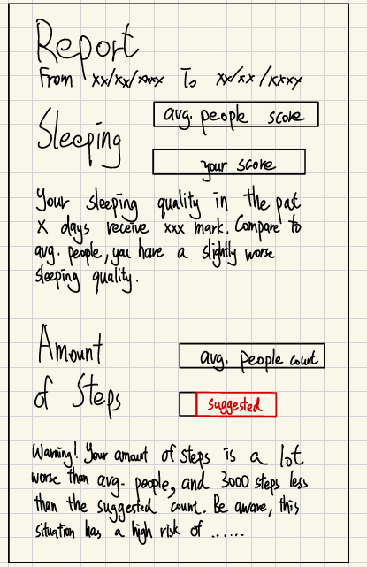

## AI Interaction Overview

### AI Tool Used
**Gemini 2.5 Pro**
**Claude Sonnet 4.5**

### Role of AI
#### Gemini:
- **Dashboard implementation**: Helped to organize and draft UI design for the weekly wellness report as described, built as a single HTML file in first step

#### Claude:
- **Architecture & Planning**: Suggested project structure and component organization
- **Code Generation**: Created React/Next.js components, TypeScript interfaces, and styling
- **Problem Solving**: Debugged issues, optimized performance, and fixed build errors
- **Design Implementation**: Implemented responsive design, animations, and visual effects

---

## Key Prompting Sessions

### 1. Initial draft for dashboard UI design
**Prompt:**
> “can you write a ui to present the weekly report showing the analyze of sideillness&mental health from user's status (e.g. sleeping quality, step counts, blood pressure, etc), showing the average people's score and user's own score with the comparison of his previous scores. If user's score is showing abnormal (e.g. , lower then suggested threshold), will appear an analyze/warning to suggest that user may experiencing wellness risk. This is a draft for the UI:”


**AI Response Summary:**

Gemini created a single HTML file including the basic functions:
- Present each health metric (Sleep, Steps, etc.) in its own card with a icon and title
- The scores are highlighted and visually compared against the average person's score, used a circular progress bar that animates when the page loads
- Scores are color-coded (green for good, red for concerning) to give immediate visual feedback on the status
- An eye-catching "Wellness Alert" appears automatically on any card where the score falls below the suggested healthy threshold, providing actionable advice

**Impact on Project:**
This initial draft established the fundamental structure and user experience philosophy for the entire dashboard system. The single HTML prototype served as a proof-of-concept that validated the key design decisions we proposed in the very first stage.

---

### 2. Prompt for more detailed functions

**Prompt:**
> "I think instead of 'get personalized tips' to leverage the AI feature, may make it analyze the larger set of data (i.e. all the collected user's data or a range), then get the trend or any useful statement. For example, could using Time Series Forecasting model, have the following usage: 1. if forecasting showing user's status not going well in the future, alert it. 2. if the forecasting before have too large difference with the current collected data, may report as a case as well"

**AI Response Summary:**
Gemini edited the AI feature to match the analyze function:
- Added dedicated "AI Wellness Outlook" section as the central hub for AI insights
- Implemented holistic trend analysis across all metrics simultaneously
- Created proactive forecasting that identifies concerning health trajectories
- Added forecast validation comparing predictions against actual outcomes
- Developed dual-alert system for trend warnings and prediction discrepancies

**Impact on Project:**
This transformed the product from a **passive data viewer** to an **active health guardian**. The shift enabled:

1. **Proactive vs. Reactive Care**: AI now forecasts problems before they become critical, aligning with early intervention principles in mental health
2. **Trust Through Accuracy**: The forecast-vs-actual validation builds user confidence over time
3. **Time Series as Foundation**: Made historical tracking and prediction core to the architecture, not optional features
4. **Nuanced Alert System**: Created three alert types (Wellness Alert, Forecast Alert, Future Outlook) that provide layered insights

This conversation established the product's key differentiator and became the foundation for all landing page messaging about "AI-Powered Predictions" and "Early Warning Systems."

---

### 3. Mobile Responsiveness and Adaptive Design

**Prompt:**
> "can you make the pop up window be adaptive for mobile devices like original file"

**AI Response Summary:**
Claude implemented a two-tier modal design:
- **Mobile (<640px)**: Fullscreen modal (`w-full h-full`) with no border radius, compact padding
- **Desktop (≥640px)**: Centered floating dialog (`max-w-3xl`) with rounded corners

Additional mobile optimizations:
- Stacked score/average layout on mobile (two rows vs. side-by-side)
- Responsive grid layouts (`grid-cols-1 md:grid-cols-2`)
- Adaptive font sizes (`text-base md:text-lg lg:text-xl`)
- Conditional text display ("Details" on mobile, "View Details" on desktop)

**Impact on Project:**
This approach followed native mobile app patterns (like Instagram, Twitter) where modals take the full screen. The responsive design system created a cohesive experience across devices, increasing accessibility and usability. The mobile-first approach ensured the landing page worked flawlessly on all screen sizes.

---

### 4. shadcn Chart Integration and Dialog Styling

**Prompt:**
> "if I want to integrate this project to next.js and using shadcn functionality, how to do it? Note that this website will be deployed via vercel in future"

**AI Response Summary:**
Claude migrated the HTML prototype to a production Next.js + shadcn/ui stack. Key steps included:

- Initialized Next.js 15 with TypeScript and Tailwind CSS 4
Installed official shadcn/ui components (Button, Card, Alert, Dialog, Table, Badge)
- Converted HTML sections into React TypeScript components
Configured Vercel deployment with vercel.json and environment variable support
- Recommended shadcn's official Chart component (Recharts-based) over Chart.js for better React integration

**Impact on Project:**
This migration transformed the prototype into a scalable, production-ready application with professional infrastructure. The component-based architecture enabled modular development and easier maintenance. Vercel's automatic deployment pipeline (via GitHub integration) streamlined the release process. The shadcn/ui foundation provided accessible, professionally styled components that reduced custom CSS needs while maintaining design flexibility. TypeScript added type safety, reducing runtime errors and improving developer experience.

---

## Project Evolution

### Phase 1: Static Display → Predictive Intelligence
**Initial State**: Dashboard showed only current week's scores with basic alerts.

**AI Breakthrough**: Gemini's suggestion to implement Time Series Forecasting transformed the product philosophy from **passive reporting** to **proactive health management**.

**Key Innovation**: Dual-alert system (trend warnings + forecast validation) that builds user trust through accuracy tracking.

---

### Phase 2: Desktop Prototype → Mobile-Friendly Experience
**Challenge**: Initial HTML mockup worked only on desktop browsers.

**AI Solution**: Claude recommended fullscreen modal pattern for mobile (<640px)

**Implementation**:
```tsx
// Mobile: Fullscreen immersive experience
<div className="w-full h-full p-4">

// Desktop: Centered floating dialog  
<div className="sm:max-w-3xl sm:mx-auto sm:p-8 sm:rounded-lg">
```
---

### Phase 3: Single HTML File → Modular Next.js Architecture
Asked Question about production deployment on Vercel.

**AI-Guided Migration**:
1. Next.js 15 + TypeScript for type safety
2. shadcn/ui components replacing custom HTML
3. Recharts instead of Chart.js for React integration
4. Component-based structure enabling parallel development

**Before/After**:
```
HTML Prototype (1,500+ lines)
    ↓
├── app/dashboard/page.tsx
└── components/
    ├── HealthCard.tsx
    ├── ChartModal.tsx
    └── AIInsights.tsx
```

**Breakthrough**: Modular architecture enabled scalable feature additions.